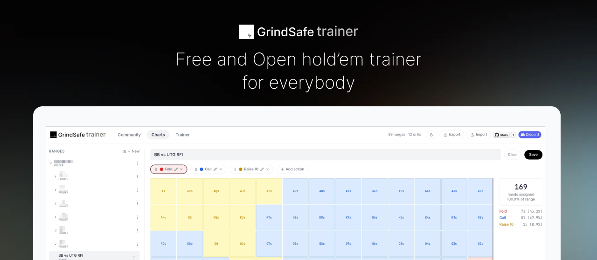

GrindSafe Trainer is a free, open-source tool created by poker players for poker players. Our mission is to make preflop range training accessible to everyone, regardless of skill level or budget. Whether you're grinding micro stakes or climbing the high-stakes ladder, building accurate preflop ranges is the foundation of a winning strategy.

This project thrives on community contributions — from range charts and drill configurations to code improvements and feature ideas. Everyone is welcome to join, learn, and help build the best free poker training tool available.

# Data Privacy

Your drilling progress is stored in your browser's localstorage, which is completely private to you. Therefore, it is important to remember that localstorage is not reliable storage space, if you change browser or manually clean up the localstorage, the data will be **deleted**.

> Localstorage is not the same as cache, you are still free to clean up your browser cache on other websites, but we highly recommend you to not clean up the localstorage on GrindSafe Trainer.

Your charts, drills and progress are stored there, you can regularly export your charts and drills as backup via the export button.

# Contributing

## Installing

Once you have cloned the project, you can go ahead and run `npm install` to install our dependencies and to start the the UI you can run `npm run dev`.
  